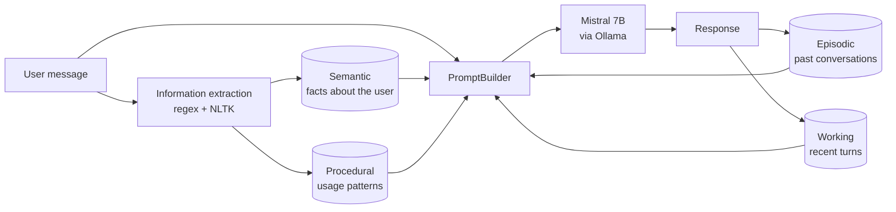

# Personal AI: a local assistant with memory

🇧🇷 [Leia em português](README.pt-BR.md)

An AI assistant that **learns about the user over the course of conversations** and runs **100% locally**: the model, memories and data all stay on your machine, with no external APIs.

The core idea is to mimic how human memory is organized. Instead of stuffing the whole history into the prompt, the system splits what it knows into **four types of memory** and, on every message, retrieves only what is relevant.


*In the screenshot above, the name "Fernando" never appears in the conversation: the assistant recalled it from earlier interactions stored in memory.*

> Built in early 2025, before "memory" became a standard feature in assistants like ChatGPT and Claude.

## How it works



| Memory | Inspired by | Implementation |
|---|---|---|
| **Working** | Short-term memory | Buffer of the last 10 turns of the current conversation |
| **Episodic** | Memories of events | Each exchange becomes an embedding in ChromaDB and is retrieved by semantic similarity to the current message |
| **Semantic** | General knowledge about someone | Structured profile (preferences, skills, goals, demographics) in JSON + vector search |
| **Procedural** | Habits and patterns | Most frequent topics and usage times |

On every message, the `PromptBuilder` assembles the context from the user profile, the past episodes most similar to the question, recurring interests and the latest turns. Only then is the model called.

## Stack

- **LLM:** Mistral 7B running locally with [Ollama](https://ollama.com)
- **Embeddings:** `all-MiniLM-L6-v2` (sentence-transformers)
- **Vector database:** ChromaDB
- **NLP:** NLTK + regular expressions
- **UI:** Gradio

## Structure

```
personal_ai/
├── app.py               # Main application and Gradio UI
├── memory/
│   ├── working.py       # Working memory
│   ├── episodic.py      # Episodic memory (ChromaDB)
│   ├── semantic.py      # Semantic memory (profile + ChromaDB)
│   └── procedural.py    # Procedural memory
├── utils/
│   ├── embedding.py     # Embedding generation
│   ├── extraction.py    # Information extraction from messages
│   └── prompting.py     # Prompt assembly from memories
└── data/                # Memories stored locally (not in git)
```

## Running it

Requirements: Python 3.12 and Ollama with the model pulled (`ollama pull mistral:7b`).

```bash
python -m venv personal-ai-venv
source personal-ai-venv/bin/activate
pip install -r requirements.txt
python app.py
```

The UI opens at http://127.0.0.1:7860.
