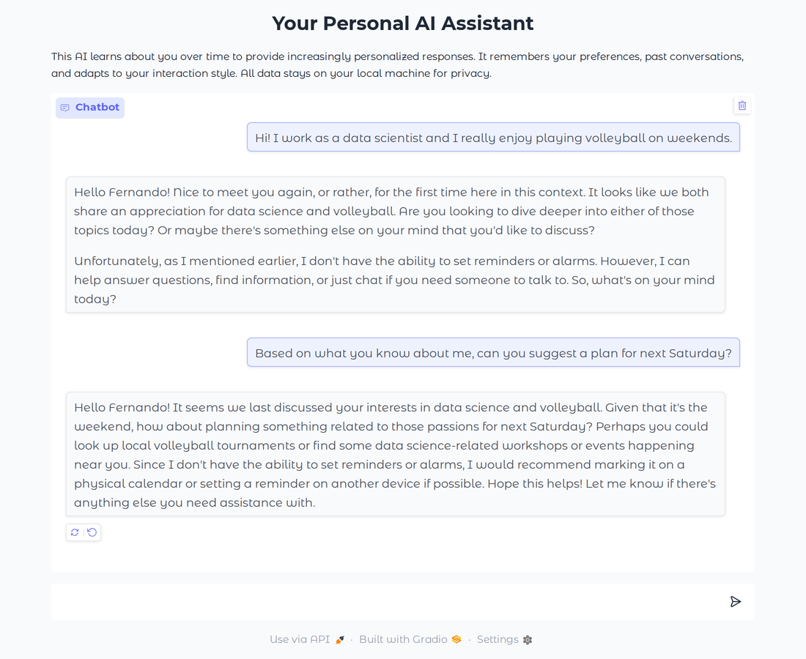
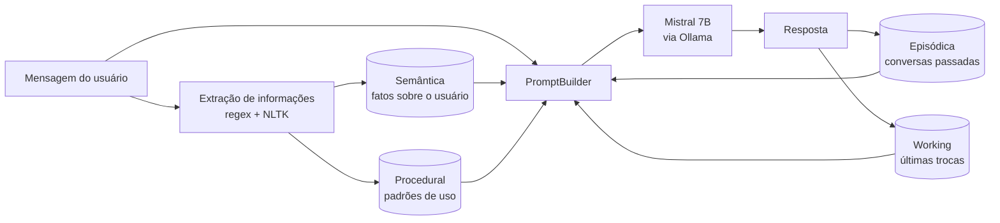

# Personal AI: um assistente local com memória

Um assistente de IA que **aprende sobre o usuário ao longo das conversas** e roda **100% local**: modelo, memórias e dados ficam na máquina, sem nenhuma API externa.

A ideia central é imitar como a memória humana é organizada. Em vez de jogar o histórico inteiro no prompt, o sistema separa o que sabe em **quatro tipos de memória** e, a cada mensagem, busca só o que é relevante.



*Na captura acima, o nome "Fernando" não aparece na conversa: o assistente o recuperou de interações anteriores guardadas na memória.*

> Projeto desenvolvido no início de 2025, antes de "memória" virar recurso padrão em assistentes como ChatGPT e Claude.

## Como funciona



| Memória | Inspiração | Implementação |
|---|---|---|
| **Working** | Memória de curto prazo | Buffer das últimas 10 trocas da conversa atual |
| **Episódica** | Lembranças de eventos | Cada conversa vira um embedding no ChromaDB e é recuperada por similaridade semântica com a mensagem atual |
| **Semântica** | Conhecimento geral sobre alguém | Perfil estruturado (preferências, habilidades, objetivos, dados demográficos) em JSON + busca vetorial |
| **Procedural** | Hábitos e padrões | Tópicos mais frequentes e horários de uso |

A cada mensagem, o `PromptBuilder` monta o contexto juntando o perfil do usuário, os episódios passados mais parecidos com a pergunta, os interesses recorrentes e as últimas trocas. Só então chama o modelo.

## Stack

- **LLM:** Mistral 7B rodando localmente com [Ollama](https://ollama.com)
- **Embeddings:** `all-MiniLM-L6-v2` (sentence-transformers)
- **Banco vetorial:** ChromaDB
- **NLP:** NLTK + expressões regulares
- **Interface:** Gradio

## Estrutura

```
personal_ai/
├── app.py               # Aplicação principal e interface Gradio
├── memory/
│   ├── working.py       # Memória de trabalho
│   ├── episodic.py      # Memória episódica (ChromaDB)
│   ├── semantic.py      # Memória semântica (perfil + ChromaDB)
│   └── procedural.py    # Memória procedural
├── utils/
│   ├── embedding.py     # Geração de embeddings
│   ├── extraction.py    # Extração de informações das mensagens
│   └── prompting.py     # Montagem do prompt com as memórias
└── data/                # Memórias salvas localmente (fora do git)
```

## Como rodar

Pré-requisitos: Python 3.12 e Ollama com o modelo baixado (`ollama pull mistral:7b`).

```bash
python -m venv personal-ai-venv
source personal-ai-venv/bin/activate
pip install -r requirements.txt
python app.py
```

A interface abre em http://127.0.0.1:7860.

## O que eu faria diferente hoje

O projeto funciona, mas reflete o que eu sabia na época. Olhando com mais experiência:

- **Extração com o próprio LLM, não regex.** Os padrões como `I am (\w+)` são frágeis: a frase "I am Fernando" fez o sistema salvar "fernando" como traço de personalidade. Hoje eu pediria ao modelo para extrair os fatos em JSON estruturado (ou usaria *tool calling*), o que também resolveria o suporte a outros idiomas, já que hoje só funciona em inglês.
- **API do Ollama em vez de `subprocess`.** Cada mensagem abre um processo `ollama run`. A API HTTP permitiria *streaming* da resposta, histórico em formato de chat e melhor tratamento de erros.
- **Memória procedural de verdade.** O módulo já calcula diretrizes de estilo (tamanho da resposta, formalidade, nível técnico), mas elas não chegam a entrar no prompt. Faltou fechar esse ciclo.
- **Esquecer e consolidar.** As memórias só crescem. Um sistema mais maduro resumiria episódios antigos, daria peso para recência e resolveria contradições (o código até registra preferências conflitantes, mas nunca as resolve).
- **Avaliação.** Não há testes nem uma forma de medir se a memória melhora as respostas. Hoje eu montaria um pequeno conjunto de conversas com fatos plantados e mediria quantos o assistente recupera corretamente.
- **Modelo mais recente.** O Mistral 7B foi uma boa escolha para rodar localmente na época, mas modelos pequenos mais novos seguem instruções bem melhor. Na captura acima, por exemplo, ele menciona lembretes sem que ninguém tenha perguntado sobre isso.
